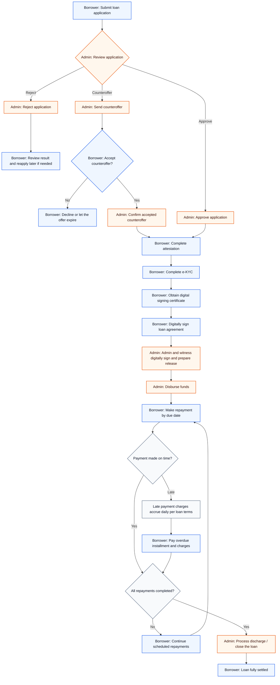

# Complete loan journey

This guide explains the usual end-to-end borrower journey in the portal, from application all the way to loan discharge after full repayment.

- [Your Meetings hub](/help/your-meetings) — one place to see attestation meeting status across loans (scheduling, Meet links, and follow-up actions).

## Visual flow

## Who does what

| Step | Owner | What happens |
| --- | --- | --- |
| Application submitted | Borrower | You fill in the application, provide required information, and submit supporting documents. |
| Review decision | Admin | The admin team reviews your application and may approve, reject, or issue a counteroffer. |
| Counteroffer response | Borrower | If a counteroffer is issued, you decide whether to accept it. |
| Attestation | Borrower | You complete the required attestation step, such as watching a video or scheduling a meeting if requested. |
| e-KYC | Borrower | You complete identity verification and any supporting checks required by the portal workflow. |
| Digital signing certificate | Borrower | You obtain the certificate needed for compliant digital signing. |
| Loan agreement signing | Borrower | You review and digitally sign the finalized loan agreement. |
| Disbursement preparation | Admin | After you sign, the admin team and a witness also sign digitally, complete the signed package, and confirm everything is ready for payout. |
| Disbursement | Admin | The approved loan amount is released to you. |
| Repayment | Borrower | You make repayments according to the schedule shown in the portal. |
| Late payment handling | Borrower | If a payment is overdue, late payment charges may accrue daily according to your loan terms until the overdue amount is cleared. |
| Discharge | Admin | After all payments are completed, the admin team closes the loan and records the discharge. |

## Stage-by-stage guide

### 1. Apply for the loan

**Borrower step**

- Complete the application form.
- Upload any required documents.
- Submit the application for admin review.

### 2. Wait for admin review

**Admin step**

The admin team will review your application and decide one of the following:

- **Approve**: the application can move forward.
- **Reject**: the process stops here unless you submit a new application later.
- **Counteroffer**: the admin team proposes revised terms for you to accept or decline.

### 3. Respond to a counteroffer if one is issued

**Borrower step**

- Review the revised loan amount, tenure, pricing, or other terms.
- Accept the counteroffer if you agree with it.
- Decline it if you do not wish to proceed.

If you accept the counteroffer, the application continues to the next steps.

### 4. Complete attestation

**Borrower step**

Depending on the portal workflow, you may need to:

- watch an attestation video,
- schedule an attestation meeting, or
- complete another required confirmation step.

This confirms that you understand the loan and are proceeding intentionally.

If your workflow uses a **lawyer meeting**, the lender may mark the meeting complete when it ends. You will then be asked in the loan (and in **Meetings** if you use that page) to **accept** the terms to continue to e-KYC and signing, or **reject** the loan if you do not wish to proceed.

### 5. Complete e-KYC

**Borrower step**

- Follow the portal instructions for identity verification.
- Provide any information or images needed for verification.

The loan cannot move to signing until the required e-KYC checks are completed successfully.

### 6. Obtain a digital signing certificate

**Borrower step**

Before digitally signing the loan agreement, you may need to obtain a digital certificate through the guided portal flow.

This certificate is used to support compliant digital execution of the agreement.

### 7. Digitally sign the loan agreement

**Borrower step**

- Review the final agreement carefully.
- Digitally sign once you are satisfied with the terms.

After signing, your part of the documentation workflow is usually complete.

### 8. Admin and witness complete signing, then disburse the loan

**Admin step**

- The admin team checks that all required borrower actions are complete.
- The admin team and a witness also digitally sign the loan agreement.
- The admin team completes the signed agreement package and prepares it for release.
- The admin team processes the disbursement.

Once disbursed, the loan becomes active.

### 9. Make repayments

**Borrower step**

- Follow the repayment schedule shown in the portal.
- Pay each installment on time.
- Keep your repayment status up to date until the balance is fully settled.

If a payment is made late, late payment charges may be charged daily according to your loan terms until the overdue amount is settled.

### 10. Loan discharge after full settlement

**Admin step**

After all scheduled payments are completed, the admin team processes the discharge and closes the loan record.

At that point, the loan journey is complete.

## Notes

- Some steps may be combined or renamed in your portal, but the overall flow remains similar.
- If your application is rejected, the process ends before attestation, e-KYC, signing, and disbursement.
- If a counteroffer is declined, the application does not proceed unless a new offer or application is created.
