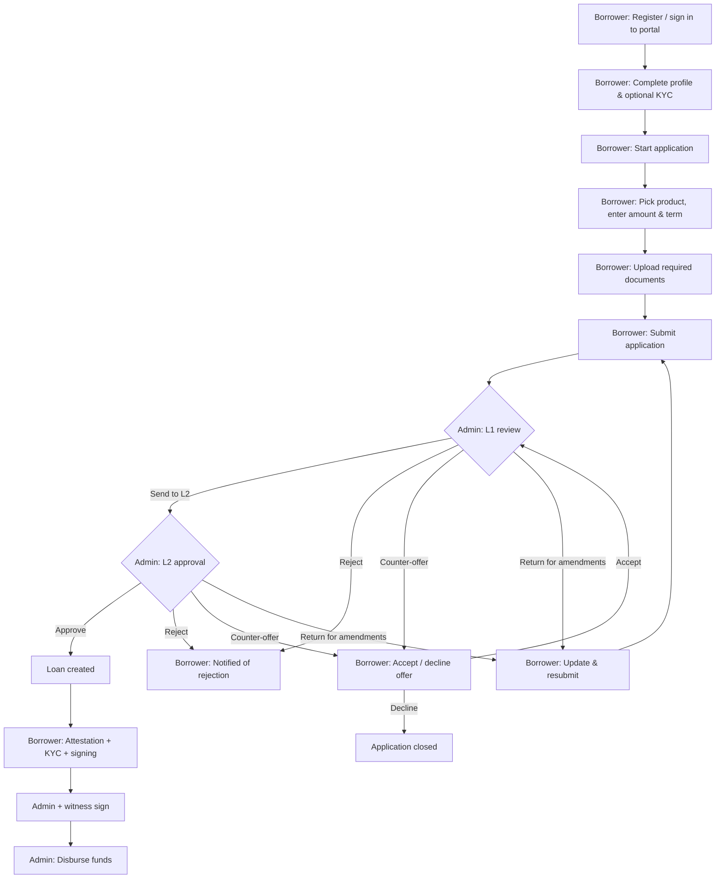

# Online Applications

"Online applications" are loan applications submitted by the borrower directly through the borrower portal, rather than created manually by admin staff. They are tagged `loanChannel = ONLINE` and route into the same L1 / L2 review queues as manual applications.

---

## End-to-End Flow

---

## Application Channel

`LoanApplication.loanChannel` tracks how the application was created.

| Value | Source |
|-------|--------|
| `ONLINE` | Borrower portal |
| `MANUAL` | Admin-created in the admin app |

The channel matters for two things:

1. **Admin UI** — online applications do not show a `Submit` button on the admin detail page (the borrower submitted; admin does not submit on behalf of the borrower).
2. **Defaults** — online applications skip the admin-created `DRAFT → SUBMITTED` hop; they enter `SUBMITTED` directly.

---

## Borrower-Side Steps

### 1. Register & Sign In

The borrower creates an account with email and password in the portal. Corporate applicants create a company account and add directors / company members.

### 2. Complete Profile (and optional KYC)

Borrowers fill out name, IC / SSM, contact details, and address. KYC can be started now or deferred until required by the admin workflow. See [Borrower KYC](?doc=borrower-portal/borrower-kyc).

### 3. Start an Application

From the loan centre, the borrower:

- Picks a **loan product** (only products eligible for their borrower type are shown)
- Enters **amount** and **term**
- Sees an auto-updating summary of legal fees, stamping fees, net disbursement, monthly payment, and total payable

### 4. Upload Documents

The portal shows the required document list from the selected product. Borrowers upload each one. Submission is blocked until all required documents are uploaded.

### 5. Submit

The borrower confirms the submission. Status becomes `SUBMITTED`. It lands in the admin **L1 queue** immediately, and the borrower sees an "awaiting review" state in their loan centre.

### 6. Respond to Counter-Offers (if any)

If an admin issues a counter-offer at L1 or L2, the borrower sees the revised terms in the portal and can:

- **Accept** — continues the review at that stage
- **Counter** — propose different terms back (if enabled)
- **Decline** — application closes

If a counter-offer expires without a response, the borrower can apply again later.

### 7. Attestation, KYC, and Signing

After final approval (L2), the borrower completes the downstream flow:

1. Attestation — watch an attestation video or attend a scheduled meeting
2. e-KYC — required before signing if not already completed
3. Signing certificate — obtained through the portal's signing flow
4. Digitally sign the loan agreement

Admin and a witness also sign; admin then disburses. See [Digital Signing Overview](?doc=digital-signing/signing-overview).

### 8. Repayment

Once disbursed, the loan appears in the borrower's loan centre with its schedule, amount due, and payment record. Borrowers can record / submit payments (subject to your deployment's payment-approval configuration) and download receipts.

---

## Admin-Side Handling

From an admin's perspective, online applications are mostly indistinguishable from manual ones. The main differences:

- Channel badge reads **Online** instead of **Manual**
- No `Submit` button on the application detail (the borrower already submitted)
- Documents originate from the borrower's own uploads (but admins can still upload extra documents)
- Counter-offer flow sends offers back to the portal rather than waiting in an admin-only negotiation state

Admins run the **L1 → L2 review** the same way as manual applications. See [Loan Applications (L1 / L2)](?doc=loan-management/loan-applications).

---

## Resubmission While Pending L2

If the borrower updates documents or resubmits while the application is in `PENDING_L2_APPROVAL`:

- The application is **reset to the L1 queue** (status `SUBMITTED`)
- All L1 and L2 metadata (`l1ReviewedAt`, `l1ReviewedByMemberId`, `l1DecisionNote`, `l2ReviewedAt`, `l2ReviewedByMemberId`, `l2DecisionNote`) is cleared
- Review restarts at L1 on the updated submission

This rule exists so that an L1 handoff decision never silently applies to a changed set of documents.

---

## Notifications

The borrower receives portal notifications (and emails, if configured) on:

- Submission acknowledged
- Counter-offer issued
- Rejection
- Return for amendments
- Approval
- Reminders to complete KYC, attestation, signing
- Disbursement
- Upcoming due date and late-payment reminders

---

## Frequently Asked Questions

### Can admins create an online application on behalf of a borrower?

No. Admin-created applications are `MANUAL` by channel. If you need the borrower to "own" the application, ask them to submit it through the portal.

### Can a borrower edit a submitted application?

Only after an admin returns it for amendments. Otherwise, the application is locked from borrower edits once submitted.

### What happens if a borrower cancels?

A borrower can withdraw a submitted application (if the deployment allows it) — status moves to a closed state and it is not actioned by admin.

### What product did the borrower see in the portal?

Only products marked as **Active** and eligible for the borrower's type (Individual / Corporate / Both). Inactive products never appear to borrowers, even if they remain in the admin UI.

### Does the portal show counter-offer history?

Yes. Each counter-offer is recorded on the application timeline, visible to both borrower and admin.

---

## Related Documentation

- [Borrower Portal Overview](?doc=borrower-portal/overview)
- [Borrower KYC](?doc=borrower-portal/borrower-kyc)
- [Loan Applications (L1 / L2)](?doc=loan-management/loan-applications)
- [Digital Signing Overview](?doc=digital-signing/signing-overview)
