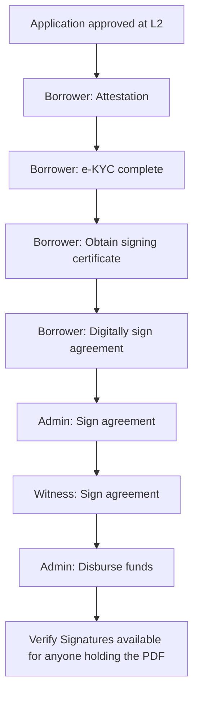

# Digital Signing Overview

TrueKredit Pro includes an integrated **digital signing** workflow for loan agreements. Borrowers, admins, and a witness each sign the same agreement PDF with their own signing certificate, producing a cryptographically verifiable signed document.

This entire workflow is Pro-only — SaaS does not include digital signing.

---

## High-Level Flow

The agreement progresses only when **each role completes their step**. The backend blocks out-of-order actions.

---

## Roles in the Signing Flow

| Role | Who they are | What they do |
|------|--------------|--------------|
| Borrower | The loan applicant (individual or a company director representing a corporate) | Sign first, after completing attestation + KYC + signing certificate |
| Admin | Someone with `agreements.manage` | Apply the admin signature on behalf of the lender |
| Witness | An **Attestor** — someone with `attestation.witness_sign` | Countersign the agreement as an independent witness |

A witness may be the same person who ran the attestation, depending on your deployment's policy.

---

## Signing Certificates

Every signer (borrower, admin, witness) needs a **signing certificate** issued by the platform's signing gateway. Certificates bind a signing key to a specific user identity so signatures can be independently verified later.

### For borrowers

- Issued through a guided flow in the borrower portal after KYC is approved
- Tied to the borrower's profile

### For admins / witnesses

- Managed in **Dashboard → TrueKredit Pro → Signing Certificates** by users with `signing_certificates.manage`
- Tied to the staff member

---

## Agreements

The agreement artefact is a PDF generated from the approved loan record. It is locked from further admin editing once signing begins — changes would invalidate signatures.

Managed from **Dashboard → TrueKredit Pro → Agreements** by users with `agreements.manage`. Each agreement has:

- The loan it belongs to
- A status: `PENDING_BORROWER_SIGN`, `PENDING_ADMIN_SIGN`, `PENDING_WITNESS_SIGN`, `SIGNED`, `VOIDED`
- A signed-PDF download once fully executed

For operational details, see [Agreements & Attestation](?doc=digital-signing/agreements-and-attestation).

---

## Verify Signatures

Anyone who holds a signed agreement PDF can verify its signatures at **Dashboard → Verify Signatures**. Upload the PDF; the page reports:

- Which certificates signed the document
- When each signature was applied
- Whether the content has been tampered with since signing

See [Verify Signatures](?doc=digital-signing/verify-signatures).

---

## Permissions Summary

| Action | Permission |
|--------|------------|
| Manage signing certificates | `signing_certificates.manage` |
| Issue / revoke agreements | `agreements.manage` |
| Apply the admin signature | `agreements.manage` |
| Schedule attestation | `attestation.schedule` |
| Apply the witness signature | `attestation.witness_sign` |
| Disburse after full signing | `loans.disburse` or `loans.manage` |

---

## Why Digital Signing Matters

- **Legal enforceability** — cryptographically signed PDFs that can be independently verified
- **Tamper evidence** — any change to the PDF after signing invalidates the signatures
- **Auditable** — who signed, when, and with which certificate is recorded in the audit log
- **No paper** — the full loan lifecycle can be completed remotely

---

## Frequently Asked Questions

### Who is the witness?

Typically a designated user holding the **Attestor** role. Your deployment may require the witness to be a different person from the borrower's credit officer or approval authority, depending on your compliance policy.

### What if the borrower loses their signing certificate?

They can start the certificate flow again from the portal. A new certificate is issued and tied to their profile; only the new one will be valid for future signatures.

### Can an agreement be signed before KYC is approved?

No. The backend enforces: KYC approved → signing certificate issued → borrower signs → admin signs → witness signs. Any attempt out of order is rejected.

### What happens to an agreement if the deal falls through?

The agreement can be voided from the Agreements page. Voided agreements are preserved for audit, but no further signatures can be applied.

### Can I re-use a single witness for many agreements?

Yes. The same witness can sign as many agreements as needed, as long as they hold `attestation.witness_sign`.

---

## Related Documentation

- [Agreements & Attestation](?doc=digital-signing/agreements-and-attestation)
- [Verify Signatures](?doc=digital-signing/verify-signatures)
- [Loan Applications (L1 / L2)](?doc=loan-management/loan-applications)
- [Loan Disbursement](?doc=loans/loan-disbursement)
